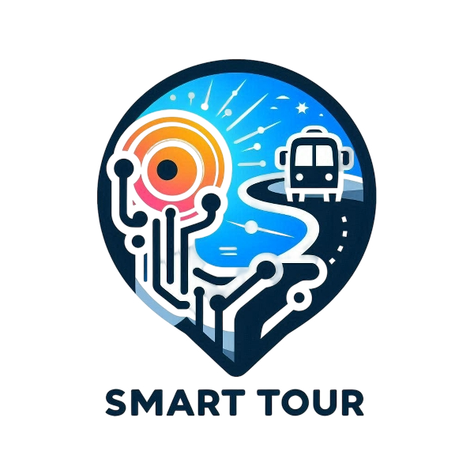

# 🌏 Smartour - Explore Indonesia, Earn Rewards



**Smartour** is an immersive blockchain-powered travel game that transforms exploring Indonesia into an exciting adventure. Discover hidden gems across the archipelago, complete quests, check-in at iconic locations, and earn **SMT (Smartour Token)** rewards on the Polygon network.

## 🎮 Game Overview

Smartour gamifies travel experiences across Indonesia, from the volcanic peaks of Sumatra to the pristine waters of Raja Ampat in Papua. Players embark on a journey as digital travelers, completing location-based quests and earning cryptocurrency rewards for their adventures.

### Core Gameplay Loop

1. **Explore** - Browse quests across 8 Indonesian regions
2. **Travel** - Visit real-world locations
3. **Check-In** - Verify your presence using GPS
4. **Complete** - Finish quest objectives (photos, social sharing, challenges)
5. **Earn** - Collect SMT tokens and unlock achievements
6. **Redeem** - Exchange tokens for real-world rewards

## ✨ Key Features

### 🗺️ **Multi-Region Quest System**
- **8 Major Regions**: Sumatra, Java, Bali, Kalimantan, Sulawesi, Nusa Tenggara, Maluku, Papua
- **41+ Active Quests**: Currently implemented across all regions
- **107 Total Destinations**: Full coverage planned (see QUEST_DATABASE.md)
- **Cultural Destinations**: Temples, natural wonders, traditional villages, and UNESCO sites
- **Dynamic Difficulty**: Easy, Medium, and Hard quests with varying rewards

### 💎 **Blockchain Integration**
- **SMT Token**: ERC-20 token on Polygon network
- **Contract Address**: `0x6242c29bb832fd3ab692940fc23540cfa87ca971`
- **Wallet Integration**: MetaMask and Web3 wallet support
- **Non-Crypto Mode**: Play without blockchain for casual users

### 📍 **Location-Based Gameplay**
- **GPS Check-In**: Verify presence within 100m of quest locations
- **Interactive Map**: Leaflet-powered map showing all quest locations
- **Distance Tracking**: See how far you are from each quest
- **Real-Time Updates**: Quest status updates based on your location

### 🏆 **Progression System**
- **Level System**: Gain XP and level up
- **Achievements**: Unlock badges for milestones
- **Leaderboard**: Compete with other travelers
- **Streak System**: Maintain daily activity for bonuses
- **Profile Stats**: Track your journey progress

### 🎁 **Rewards & Redemption**
- **Token Rewards**: Earn 50-500 SMT per quest
- **Vouchers**: Redeem for travel discounts
- **Exclusive Perks**: Access to partner benefits
- **NFT Badges**: Collectible achievement NFTs (coming soon)

## 🎯 Quest Types

### 📸 **Photo Quests**
Capture and share photos at specific locations
- **Example**: Tegallalang Rice Terraces, Ubud

### 🏛️ **Visit Quests**
Check-in at cultural and historical sites
- **Example**: Borobudur Temple, Tugu Pahlawan

### 🏃 **Challenge Quests**
Complete physical challenges or adventures
- **Example**: Mount Bromo Sunrise Trek, Raja Ampat Diving

### 📱 **Social Quests**
Share experiences on social media
- **Example**: Tanggulangin Leather Center visit

## 🌍 Featured Destinations

### Sumatra
- 🏔️ Lake Toba - Largest volcanic lake
- 🦧 Bukit Lawang - Orangutan trekking
- 🌊 Mentawai Islands - World-class surfing
- 🏛️ Banda Aceh Tsunami Museum

### Java
- 🛕 Borobudur - World's largest Buddhist temple
- 🏛️ Prambanan - Hindu temple complex
- 🌋 Mount Bromo - Iconic sunrise views
- 🔥 Mount Ijen - Blue fire phenomenon

### Bali
- 🌊 Tanah Lot - Iconic sea temple
- 🌾 Tegallalang - Stunning rice terraces
- 🏔️ Mount Batur - Sunrise trekking

### Kalimantan
- 🦧 Tanjung Puting - Orangutan sanctuary
- 🤿 Derawan Islands - Diving paradise
- 🏡 Dayak Longhouse - Traditional culture

### Sulawesi
- 🐠 Bunaken - Marine biodiversity hotspot
- ⚰️ Tana Toraja - Unique funeral traditions
- 🏝️ Togean Islands - Pristine paradise

### Nusa Tenggara
- 🦎 Komodo Island - Home of Komodo dragons
- 🌸 Pink Beach - Rare pink sand
- 🏔️ Mount Rinjani - Second highest volcano

### Maluku
- 🌶️ Banda Islands - Historic Spice Islands
- 🐠 Ambon Bay - Rare marine life

### Papua
- 🤿 Raja Ampat - World's most biodiverse reefs
- 🏔️ Baliem Valley - Highland trekking
- ⛰️ Carstensz Pyramid - Indonesia's highest peak

## 🚀 Getting Started

### For Players

1. **Open the App**: Access via Telegram Mini App or web browser
2. **Complete Onboarding**: Learn the basics
3. **Choose Your Region**: Select where you want to explore
4. **Pick a Quest**: Browse available quests
5. **Travel & Check-In**: Visit the location and verify
6. **Earn Rewards**: Collect SMT tokens
7. **Connect Wallet** (Optional): Link MetaMask for blockchain rewards

### For Developers

#### Prerequisites
- Node.js 18+ and npm
- Git
- MetaMask or Web3 wallet (for testing blockchain features)

#### Installation

```bash
# Clone the repository
git clone https://github.com/yourusername/smartour.git
cd smartour

# Install dependencies
npm install

# Start development server
npm run dev
```

#### Environment Setup

Create a `.env` file:
```env
VITE_POLYGON_RPC_URL=https://polygon-rpc.com/
VITE_SMT_TOKEN_ADDRESS=0x6242c29bb832fd3ab692940fc23540cfa87ca971
```

#### Build for Production

```bash
npm run build
```

## 🛠️ Technology Stack

### Frontend
- **React 18** - UI framework
- **TypeScript** - Type safety
- **Vite** - Build tool
- **React Router** - Navigation

### Blockchain
- **ethers.js** - Web3 integration
- **Polygon Network** - Layer 2 scaling
- **MetaMask** - Wallet connection

### Maps & Location
- **Leaflet** - Interactive maps
- **React-Leaflet** - React bindings
- **Geolocation API** - GPS tracking

### Styling
- **CSS3** - Custom styling
- **CSS Variables** - Theming
- **Animations** - Smooth transitions

### Telegram Integration
- **Telegram Mini App SDK** - Platform integration
- **Telegram WebApp API** - Native features

## 📱 Platform Support

- ✅ **Telegram Mini App** - Primary platform
- ✅ **Web Browser** - Desktop and mobile
- ✅ **Progressive Web App** - Installable
- 🔄 **iOS/Android** - Via Telegram or PWA

## 🎨 Design Philosophy

### Traveler-Centric Experience
- **Intuitive Navigation**: Easy-to-use interface
- **Visual Storytelling**: Rich imagery and animations
- **Cultural Authenticity**: Respectful representation
- **Accessibility**: Inclusive design for all users

### Gamification Elements
- **Progress Visualization**: Clear level and XP tracking
- **Achievement System**: Collectible badges
- **Social Features**: Leaderboards and sharing
- **Reward Feedback**: Satisfying completion animations

## 🔐 Security & Privacy

- **Wallet Security**: Non-custodial wallet integration
- **Location Privacy**: GPS data never stored on servers
- **Data Protection**: Minimal data collection
- **Smart Contract Audited**: Secure token transactions

## 🌟 Roadmap

### Phase 1 (Current)
- ✅ Core gameplay mechanics
- ✅ 26+ quests across 8 regions
- ✅ Blockchain integration
- ✅ Telegram Mini App launch

### Phase 2 (Q1 2025)
- 🔄 NFT achievement badges
- 🔄 Multiplayer challenges
- 🔄 Partner integrations (hotels, tours)
- 🔄 Enhanced social features

### Phase 3 (Q2 2025)
- 📋 User-generated quests
- 📋 AR experiences
- 📋 Cross-chain support
- 📋 Mobile native apps

### Phase 4 (Q3 2025)
- 📋 Global expansion beyond Indonesia
- 📋 DAO governance
- 📋 Staking rewards
- 📋 Marketplace for travel services

## 🤝 Contributing

We welcome contributions! Please see our [Contributing Guidelines](CONTRIBUTING.md) for details.

### Development Workflow

1. Fork the repository
2. Create a feature branch (`git checkout -b feature/amazing-feature`)
3. Commit your changes (`git commit -m 'Add amazing feature'`)
4. Push to the branch (`git push origin feature/amazing-feature`)
5. Open a Pull Request

## 📄 License

This project is licensed under the MIT License - see the [LICENSE](LICENSE) file for details.

## 🙏 Acknowledgments

- **Indonesian Tourism Board** - Destination information
- **Polygon Network** - Blockchain infrastructure
- **Telegram** - Platform support
- **OpenStreetMap** - Map data
- **Community Contributors** - Quest suggestions and testing

## 📞 Contact & Support

- **Website**: [smartour.app](https://smartour.app)
- **Telegram**: [@smartour_official](https://t.me/smartour_official)
- **Twitter**: [@smartour_game](https://twitter.com/smartour_game)
- **Email**: support@smartour.app
- **Discord**: [Join our community](https://discord.gg/smartour)

## 🎮 Start Your Adventure Today!

Download Smartour on Telegram and begin exploring Indonesia's incredible destinations while earning crypto rewards!

[🚀 Launch Smartour](https://t.me/smartour_bot)

---

**Made with ❤️ for travelers and adventurers worldwide**

*Explore. Discover. Earn. Repeat.*
